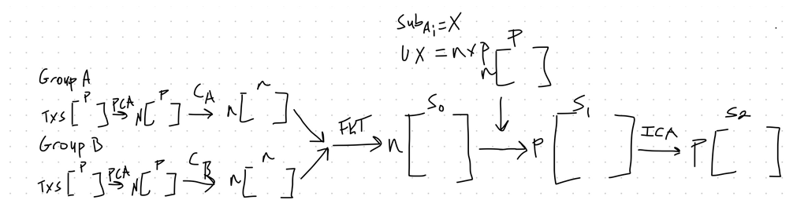

# 2024.01.23

## General Notes

## Algorithm Design

### Developments

### Questions

* [ ] Would it be better to use PCA to group subjects temporally so SPADE will output temporal axes and will allow for one projection?
  *
  [ ] 
      <figure><figcaption></figcaption></figure>
* [ ] What is the correct way to project: use both U and V, mask F, and any demeaning on X
  *
  [ ] 
      <figure><figcaption></figcaption></figure>

## Code

### Developments

### ToDo

* [ ] Fix FKT\_proj to match the correct projection and demeaning

